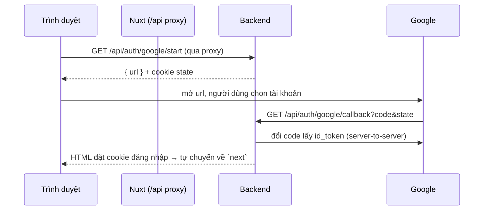

# Đăng nhập Google — hướng dẫn cấu hình

> Code đã xong và có test. Đây là 4 bước lấy khóa (chỉ bạn làm được — tôi không
> có quyền trên Google Cloud của bạn). Chưa cấu hình thì nút "Tiếp tục với
> Google" vẫn hiện nhưng kèm dòng nhắc, bấm vào sẽ báo "chưa cấu hình".

## Cách hoạt động (tóm tắt)

Luồng **authorization code phía server** — client secret không bao giờ lộ ra
trình duyệt:



Ghi chú kỹ thuật: **không** dùng redirect 3xx qua proxy `/api` vì proxy (ofetch)
tự đi theo redirect phía máy chủ và sẽ nuốt mất — nên `/start` trả JSON, còn
`/callback` trả HTML tự điều hướng. Set-Cookie qua proxy vẫn tới trình duyệt.

## 4 bước cấu hình

### 1. Tạo OAuth client trong Google Cloud

1. Vào <https://console.cloud.google.com> → chọn (hoặc tạo) một project.
2. **APIs & Services → OAuth consent screen**: chọn *External*, điền tên ứng
   dụng, email hỗ trợ, logo (tùy). Thêm scope `openid`, `email`, `profile`. Khi
   còn ở chế độ *Testing* thì thêm email của bạn vào *Test users*.
3. **APIs & Services → Credentials → Create credentials → OAuth client ID**.
   - Application type: **Web application**.
   - **Authorized redirect URIs** — thêm ĐÚNG chuỗi này (đổi tên miền cho khớp
     `APP_PUBLIC_BASE_URL`). **Khai HAI dòng**: một cho app công khai, một cho
     khu quản trị (origin riêng — xem mục "Đăng nhập Google cho khu quản trị"):

     | Môi trường | Redirect URI |
     |---|---|
     | Dev — app công khai | `http://localhost:3010/api/auth/google/callback` |
     | Dev — khu quản trị | `http://localhost:3020/api/auth/google/callback` |
     | Thật — app công khai | `https://mien-cua-ban.vn/api/auth/google/callback` |
     | Thật — khu quản trị | `https://admin.mien-cua-ban.vn/api/auth/google/callback` |

4. Bấm *Create* → Google đưa **Client ID** và **Client secret**.

### 2. Điền vào `.env` gốc (cùng thư mục `docker-compose.yml`)

```dotenv
APP_GOOGLE_CLIENT_ID=xxxx.apps.googleusercontent.com
APP_GOOGLE_CLIENT_SECRET=xxxx
# Phải khớp tên miền đã khai redirect URI ở trên:
APP_PUBLIC_BASE_URL=http://localhost:3010     # dev; đổi sang https://... khi lên thật
APP_ADMIN_BASE_URL=http://localhost:3020      # dev; đổi sang https://admin.... khi lên thật
```

> ⚠️ **Quan trọng với bản chạy Docker:** container KHÔNG tự đọc file `.env` —
> biến chỉ vào container khi được khai trong `docker-compose.yml`. Ba biến trên
> đã được map sẵn trong anchor `x-app-env` (nội suy từ `.env` gốc), nên chỉ cần
> điền `.env` là đủ. Nếu bạn thêm biến MỚI khác, phải thêm dòng tương ứng vào
> `x-app-env` thì container mới thấy.

### 3. Khởi động lại backend (bắt buộc — settings nạp một lần lúc khởi động)

```bash
docker compose up -d backend
```

### 4. Kiểm tra

```bash
# Phải trả {"google": true}
curl -s http://localhost:8010/api/auth/oauth-config
```

Rồi mở <http://localhost:3010/login> → bấm **Tiếp tục với Google** → chọn tài
khoản → quay lại đã đăng nhập.

## Đăng nhập Google cho khu quản trị (:3020 / admin.<domain>)

Trang đăng nhập quản trị có thêm nút **Tiếp tục với Google**, nhưng luồng chặt
hơn app công khai vì cửa quản trị đọc được dữ liệu mọi người dùng:

- **Origin riêng, redirect URI riêng.** Frontend admin gọi
  `/api/auth/google/start?app=admin` → backend dùng
  `APP_ADMIN_BASE_URL/api/auth/google/callback`. Google gọi thẳng về origin
  admin nên cookie đăng nhập đặt tại đó, KHÔNG phải chia sẻ cookie với app công
  khai. Cờ `admin` được ký vào `state` để `/callback` đổi token bằng đúng
  redirect URI đó (Google bắt buộc khớp).
- **Chỉ cho admin đã tồn tại — KHÔNG tự tạo tài khoản.** Callback ở chế độ admin
  chỉ đăng nhập nếu Google khớp một tài khoản đã có và `role='admin'`. Người lạ
  (chưa có tài khoản) hoặc tài khoản thường bị từ chối, KHÔNG đặt cookie, KHÔNG
  đẻ tài khoản — cửa quản trị không thành nơi nuôi tài khoản.
- **Admin cũ dùng mật khẩu lần đầu bấm Google**: nếu email Google đã kiểm chứng
  và khớp email của admin đó thì tự **gắn** Google vào tài khoản (không tạo mới).
  Email chưa kiểm chứng thì không khớp, tránh mạo danh qua email trùng.

## Hành vi & quyết định thiết kế

- **Tài khoản mới qua Google** không có mật khẩu (`password_hash` rỗng,
  `auth_provider='google'`). Đăng nhập bằng mật khẩu vào tài khoản đó sẽ được
  chỉ sang đúng nút Google.
- **Email trùng tài khoản mật khẩu cũ**: tự **liên kết** Google vào tài khoản
  đó — nhưng chỉ khi Google xác nhận email đã kiểm chứng (`email_verified`),
  để tránh chiếm tài khoản bằng email chưa xác minh.
- **Email đã xác minh của Google** → đánh dấu `email_verified_at` luôn, dùng
  được trợ lý ngay mà không cần thư xác minh.
- **Chống nuôi tài khoản**: tạo tài khoản Google mới vẫn chịu trần số tài
  khoản/thiết bị như đăng ký thường (fingerprint) — Google không thành cửa lách.
- **Chống giả mạo callback**: `state` ký (JWT, hạn 10') + cookie đối chiếu; id
  token soi `aud`/`iss`/`exp`.

## Việc còn treo (nói trước cho rõ)

- **Chưa thử với credential Google thật** — toàn bộ luồng được kiểm bằng test
  giả lập token endpoint (`backend/tests/test_auth_google.py`, 11 ca). Lần chạy
  thật đầu tiên cần bạn có Client ID/Secret.
- **Chỉ Google.** Facebook/GitHub/Apple chưa làm (theo yêu cầu).
- **Tài khoản chỉ-Google chưa đặt mật khẩu**: hiện chưa có luồng "đặt mật khẩu"
  và việc *xóa tài khoản* (`/account`) vẫn hỏi mật khẩu — người dùng Google
  thuần sẽ chưa xóa được bằng đường đó. Nên bổ sung luồng "đặt mật khẩu" cho
  tài khoản Google ở lần sau nếu cần.
